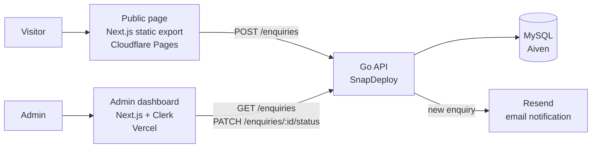

# Synthcore Enquiries System

A small full-stack system built for the Synthcore Junior Software Engineer technical assessment. Visitors submit an enquiry through a public page, a Go API stores it in MySQL, and an admin reviews and updates enquiries in a login-protected dashboard. A new enquiry also triggers an email notification.

**Author:** Chamika Gunarathne

## Live links

| Part | URL |
|---|---|
| Public enquiry page | https://synthcore-assessment.pages.dev/ (Cloudflare Pages) |
| Admin dashboard | https://synthcore-assessment.vercel.app/ |
| Backend API | https://synthcore-backend-a1ab1.containers.snapdeploy.app |
| API health check | https://synthcore-backend-a1ab1.containers.snapdeploy.app/health |

**Test login for the admin dashboard:** the email and password are in the submission email.

> **Cold starts.** Both the backend and the database run on free tiers that go idle. The first request after a quiet period can take 60–90 seconds while the container wakes up. If something looks broken, open the backend `/health` URL **in a browser** (not curl) and wait for `{"status":"ok"}`, then retry.

## Architecture



The repository holds three separate apps:

```
synthcore-assessment/
├── public-page/   Next.js (static export) – the enquiry form
├── backend/       Go API – validation, MySQL, email notification
└── admin/         Next.js + Clerk – protected dashboard
```

## What each part does

### Public page (`public-page/`)
- A single page with one form: name, email, company, message.
- Built with `output: "export"`, so it builds to plain static files and needs no server.
- Calls the backend directly from the browser and shows a success or error message.

### Backend (`backend/`)
Written in Go using only the standard library plus the MySQL driver and `godotenv`.

| Method | Path | Purpose |
|---|---|---|
| `POST` | `/enquiries` | Validate and store a new enquiry |
| `GET` | `/enquiries` | List all enquiries, newest first |
| `PATCH` | `/enquiries/{id}/status` | Change an enquiry's status |
| `GET` | `/health` | Health check |

Validation on create: `name` and `message` are required, `email` must look like an email address, and `name`, `email` and `company` are limited to 255 characters. Input is trimmed, and all SQL uses parameterised queries. Status must be one of `New`, `In Progress` or `Closed`.

After a successful insert, the API sends a notification email through Resend in a background goroutine. The email is best-effort: if Resend is slow or down, the enquiry is still saved. Visitor-supplied text is HTML-escaped before it goes into the email.

### Database
Managed MySQL on Aiven (free plan), connected over TLS with the Aiven CA certificate pinned. One table:

```sql
CREATE TABLE enquiries (
    id INT AUTO_INCREMENT PRIMARY KEY,
    name VARCHAR(255) NOT NULL,
    email VARCHAR(255) NOT NULL,
    company VARCHAR(255),
    message TEXT NOT NULL,
    status ENUM('New', 'In Progress', 'Closed') NOT NULL DEFAULT 'New',
    created_at TIMESTAMP NOT NULL DEFAULT CURRENT_TIMESTAMP
);
```

### Admin dashboard (`admin/`)
- Next.js (App Router) with Clerk for authentication. There are no hardcoded passwords.
- The dashboard page calls `auth.protect()` itself, so an unauthenticated visitor is redirected to `/sign-in` before any data is fetched. `proxy.ts` only runs `clerkMiddleware()` so Clerk can manage sessions.
- Lists enquiries newest first, lets the admin change status with a dropdown, and has a sign-out button (Clerk's `UserButton`).

## Running locally

**Requirements:** Go 1.27+, a current Node.js LTS, and npm.

### 1. Database
Create a MySQL database (the project uses Aiven's free MySQL), run the `CREATE TABLE` statement above, and download the service's CA certificate.

### 2. Backend
```bash
cd backend
mkdir certs        # put the Aiven CA certificate at certs/ca.pem
```

Create `backend/.env`:

```
DB_HOST=your-mysql-host
DB_PORT=your-mysql-port
DB_USER=your-db-user
DB_PASSWORD=your-db-password
DB_NAME=defaultdb
PORT=8080

# Optional – email notification
RESEND_API_KEY=re_xxxxxxxx
NOTIFY_EMAIL=address-that-receives-notifications
```

```bash
go run .           # note the dot: it builds every .go file in the folder
curl http://localhost:8080/health
```

### 3. Public page
Create `public-page/.env.local`:

```
NEXT_PUBLIC_API_URL=http://localhost:8080
```

```bash
cd public-page
npm install
npm run dev        # http://localhost:3000
```

### 4. Admin dashboard
Create a Clerk application, then create `admin/.env.local`:

```
NEXT_PUBLIC_CLERK_PUBLISHABLE_KEY=pk_test_xxxxxxxx
CLERK_SECRET_KEY=sk_test_xxxxxxxx
NEXT_PUBLIC_API_URL=http://localhost:8080
```

```bash
cd admin
npm install
npm run dev        # use a different port if the public page is running: npm run dev -- -p 3001
```

## Environment variables

| App | Variable | Notes |
|---|---|---|
| backend | `DB_HOST`, `DB_PORT`, `DB_USER`, `DB_PASSWORD`, `DB_NAME` | MySQL connection |
| backend | `DB_CA_CERT` | CA certificate contents, used in production. Locally the app falls back to `certs/ca.pem` |
| backend | `RESEND_API_KEY`, `NOTIFY_EMAIL` | Optional. If missing, the email step is skipped and the enquiry still saves |
| backend | `RESEND_FROM` | Optional sender. Defaults to `onboarding@resend.dev` |
| backend | `PORT` | Set by the host in production |
| public-page | `NEXT_PUBLIC_API_URL` | Baked in at build time |
| admin | `NEXT_PUBLIC_CLERK_PUBLISHABLE_KEY`, `CLERK_SECRET_KEY` | From the Clerk dashboard |
| admin | `NEXT_PUBLIC_API_URL` | Backend URL |

No secrets are committed. `.env` files and `backend/certs/` are gitignored.

## Deployment

| Part | Platform | Key settings |
|---|---|---|
| Public page | Cloudflare Pages | Root `public-page`, build `npm run build`, output `out` |
| Admin | Vercel | Root `admin`, Next.js preset |
| Backend | SnapDeploy (Docker) | Root `backend`, `Dockerfile`, port 8080, env vars set in the dashboard |
| Database | Aiven MySQL (free plan) | TLS required |

Auto-deploy is on for `main` on each platform. The backend `Dockerfile` is a multi-stage build: it compiles the Go binary with the same Go version as `go.mod`, then copies only the binary into a small Alpine image.

## Known limitations

- **CORS allows any origin (`*`).** In production this would be limited to the two frontend domains.
- **Email uses Resend's test sender**, which can only deliver to the Resend account owner. A real deployment would verify a domain and send to the team's inbox.
- **Free-tier idle behaviour.** The backend container sleeps when idle and the Aiven service can power off, so first requests can be slow or fail until they wake.
